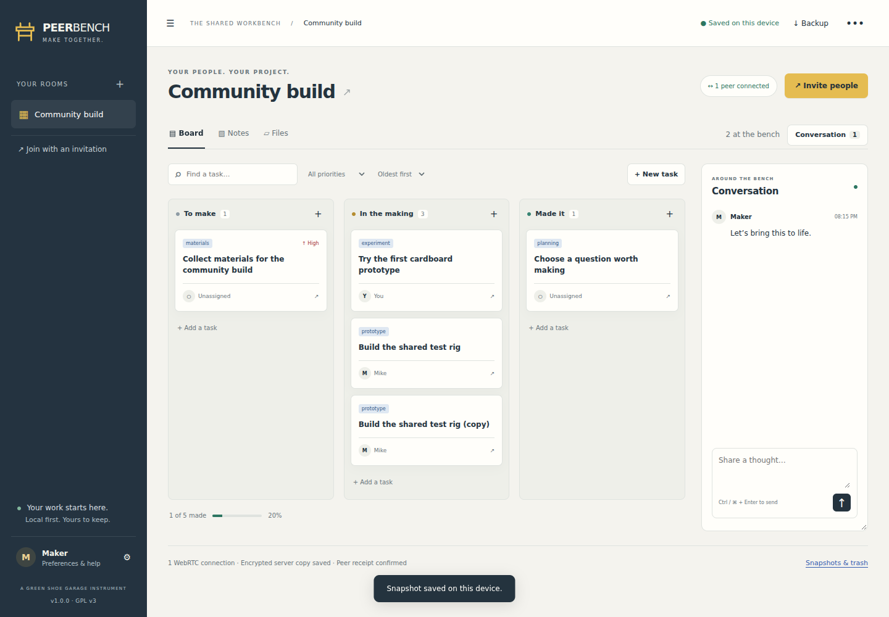

# PEERBENCH

**Make together. Keep your work.** A local-first collaboration room for makers, small teams, workshops, and project partners.

Version **1.0.0** · Green Shoe Garage · **GNU GPL v3 only**

**CREATE → INVITE → MAKE → KEEP**



## Run it

Install **Node.js 24 or newer**, extract this ZIP, open a terminal in its folder, and run:

```sh
node server/peerbench.mjs
```

Open **http://localhost:8787**. This works on macOS, Windows, and Linux where Node 24 is available. No npm install, compilation, account, or external service is required to run the release. The prebuilt server and browser code are included.

Create a room, or choose **Explore a sample**. All rooms start local. Choose **Invite people → Save & connect**, then copy the invitation into a second browser profile or send it to a collaborator using your deployed HTTPS address.

`localhost` points to the person’s own computer: a localhost invitation will not connect a friend on another computer. For remote collaboration, deploy the app and server at a reachable HTTPS address as described below. Opening `index.html` with `file://` is not supported.

## What works

- Multiple rooms with editable names and private invitation links.
- Task boards with three stages, descriptions, assignees, dates, labels, priorities, search, filtering, sorting, duplication, and trash recovery. Move cards by dragging or by changing the stage in their editor.
- Shared plain-text / Markdown notes with concurrent Yjs text editing, note titles, local undo/redo, and Markdown export.
- Persistent room conversation with display names and timestamps.
- WebRTC data channels, encrypted signaling, and encrypted WebSocket relay fallback. The UI reports actual connection state.
- Optional encrypted server archive for notes, cards, conversation, and file metadata. Later arrivals can catch up while other devices are closed.
- File attachments: up to 10 MiB per file and 100 MiB of attachment metadata per room, including files in trash. Explicit downloads, 32 KiB transfer chunks, backpressure, SHA-256 checks, and resumable partial downloads held locally. Transfers can resume from another peer holding the same file.
- IndexedDB autosave with separate local-save, peer-receipt, and server-archive indicators.
- JSON backup/restore, local snapshots, recoverable task/note/file trash, and fresh empty rooms.
- A printable project report suitable for Save as PDF.
- Warm light, dark, and high-contrast appearances; collapsible navigation and conversation; persistent desktop conversation width; keyboard controls and responsive layouts.
- Service-worker caching for offline use after a successful first load. No CDN runtime dependencies, telemetry, or AI.

## What goes on a static host?

Copy these **seven files together**, preserving their names:

```text
index.html
app.js
app.css
sw.js
manifest.webmanifest
icon.svg
config.json
```

They can live at the root or under a route such as `/peerbench/`. They require no build step. Configure `config.json` with your companion server’s WebSocket address when the server runs elsewhere:

```json
{
  "signalingUrl": "wss://peerbench-server.example.com/connect",
  "iceServers": [],
  "persistByDefault": true
}
```

On the server, set `ALLOWED_ORIGINS` to the exact frontend origin, such as `https://mbparks.com` (no path or trailing slash). Multiple origins may be comma-separated. Restart the server after changing its environment. If the app and server share a hostname, the default same-host origin check is sufficient.

The static files provide offline individual use. Cross-device collaboration also needs the included server or a compatible deployment of it. Uploading only `index.html` is not enough.

## Host the complete app

The Node server serves the seven static files and `/connect` from one origin. Put it behind an HTTPS reverse proxy; an example Caddy configuration is in `docs/Caddyfile.example`.

```sh
# Node: configurable port and durable directory
PORT=8787 DATA_DIR=/path/to/peerbench-data node server/peerbench.mjs
```

For PowerShell:

```powershell
$env:PORT = "8787"
$env:DATA_DIR = "C:\peerbench-data"
node server/peerbench.mjs
```

Or use Docker Compose:

```sh
docker compose up -d --build
```

Compose binds only to `127.0.0.1:8787` by default; expose it through your HTTPS reverse proxy. The named volume holds encrypted room records. Do not remove that volume during upgrades. Docker downloads a Node image on the first build; the app itself does not compile during this step.

For Railway or a similar Node/container service: deploy the included Dockerfile, attach a persistent volume at `/app/data`, and enable HTTPS. The process reads `PORT`. Configure origin allowlisting if the frontend is elsewhere. This package has not been deployed to any user account automatically.

### Server configuration

| Variable | Default | Meaning |
|---|---|---|
| `PORT` | `8787` | Listening port |
| `HOST` | `0.0.0.0` | Listening interface |
| `DATA_DIR` | `./data` | Directory for the SQLite archive |
| `ALLOWED_ORIGINS` | Same host | Comma-separated exact allowed frontend origins |
| `MAX_ROOM_MB` | `64` | Encrypted archive quota per room |
| `MAX_ROOMS` | `200` | Maximum distinct room capabilities on this server |

Each room supports up to **10 concurrent device connections**. This is a conservative first-release ceiling, not a paid tier. A browser tab counts as a device connection. The tested collaboration scenarios use two or three isolated browser contexts; 10-device load and real-world mobile-network tests remain to be performed.

## Direct connections, relay, and TURN

The app attempts a WebRTC connection between room participants. Network changes, firewalls, NAT, and browser behavior can prevent this. While connected to the companion server, encrypted WebSocket relay carries the same room updates and requested attachments as a fallback.

No public STUN or TURN service is used automatically. Configure your own in `config.json` or **Invite people → Connection settings → Advanced**:

```json
[
  { "urls": "stun:turn.example.com:3478" },
  {
    "urls": ["turn:turn.example.com:3478?transport=udp", "turns:turn.example.com:5349?transport=tcp"],
    "username": "YOUR_TURN_USERNAME",
    "credential": "YOUR_TURN_CREDENTIAL"
  }
]
```

Use a properly configured TURN service such as coturn, appropriate firewall rules, TLS certificates where applicable, and short-lived credentials where possible. TURN deployment is operator-managed and was not exercised against an external network during this build. Per-room ICE configuration is local and excluded from invitation links. Credentials in a public `config.json` are visible to anyone who loads the app; do not put privileged secrets there.

## Where data lives

| Data | Browser | Companion server |
|---|---|---|
| Shared records | Plaintext IndexedDB, available offline | AES-256-GCM encrypted updates when archive is enabled |
| Invitation key | Local room record; invitation URL fragment until accepted | Never sent to the server |
| Authentication capability | Derived from room key | SHA-256 derived capability used for room access |
| File metadata | Shared with room members | Encrypted with shared records |
| File bytes | Only on devices that added or received them | Forwarded as ciphertext if relay is needed; not archived |
| Snapshots | Local to the device | Not separately uploaded |
| Exported backup | A plaintext download | Not uploaded automatically |

The service can see room IDs, timing, message sizes, IP addresses, and the room access capability. It cannot decrypt content without the invitation key. The HTTPS host delivers executable app code, so users must trust the host to serve the intended application. This is a trusted-team collaboration tool; it has not undergone an independent cryptographic audit.

Everyone with an invitation has full read/write access. Names are self-selected, not verified identities. There are no enforced read-only roles, member revocation, key rotation, or authenticated audit trail in v1.0. To exclude a former collaborator, restore/export into a new room and share its new invitation only with current members; prior copies cannot be recalled.

The archive option is applied by each connected device. Turning it off stops that device uploading new archive entries; it does not erase entries already stored, prevent another member from archiving, or remove copies on other devices.

## Saving, backups, and recovery

- **Saved on this device** means an IndexedDB write completed.
- **Peer receipt confirmed** means a peer acknowledged the latest outgoing update; it is not a guarantee that every collaborator has it or has written it to disk.
- **Encrypted server copy saved** means the server acknowledged the pending archive writes from this session.
- When offline, continue working. Use Save & connect again, or enable automatic reconnection. Devices exchange full CRDT state on reconnection.
- **Backup** exports shared records and file bytes currently held on this device. Files listed but never downloaded are represented by metadata only. Invitations/keys are excluded.
- **Restore a backup** creates an independent local room with a new invitation. It does not merge into or replace a live room.
- **Snapshots & trash** restores deleted tasks, notes, and file metadata. A snapshot restoration opens an independent room and copies any corresponding files available locally.
- **Fresh start** creates a blank room while keeping current work.
- **Remove room from this device** deletes that local room, its snapshots, and local attachment bytes. It does not delete remote copies.
- Browser site-data clearing removes local rooms and their keys. Browser storage may also be evicted. Request persistent storage in Preferences and retain regular backups and invitation links in a safe place.

Back up server data using `node server/admin.mjs backup /absolute/path/backup.sqlite` while the server is running, or stop the server before copying its complete data directory. The archive cannot recover the invitation key. Operator tools are described in `docs/OPERATIONS.md`.

## Boundaries and roadmap

This release is for small, trusted groups. It supports plain text/Markdown rather than rich-text rendering. Concurrent edits to different task fields merge; simultaneous changes to the same scalar field converge to one CRDT-selected value. Snapshots are recovery points, not per-edit audit history.

File transfer requires at least one connected holder. Files are capped at 10 MiB and the room attachment total at 100 MiB to keep browser memory and portable backups manageable. Backup imports are capped at 150 MiB. Files and full shared-state transfers are buffered in memory. Rooms are not intended for media libraries or very large histories.

The encrypted archive is append-only, with a 64 MiB default per-room quota. Reconnection snapshots consume space; automatic encrypted-log compaction is a future improvement. At quota, the app reports the failure and local work remains available. Export/restore to a new room before retiring the old archive.

Future milestones: v1.1 selective history and archive compaction; v1.2 richer notebook/whiteboard tools; v2 authenticated identities, key rotation, fine-grained access, and optional media sessions. See `ROADMAP.md`.

## Develop and verify

The editable source is included under `src/` and `server/server.mjs`. Prebuilt outputs are checked into the package.

```sh
npm ci
npm run build
npm test
```

The build bundles Yjs into `app.js` and ws into `server/peerbench.mjs`. Node built-ins remain external. Browser integration tests are in `tests/browser.cjs`; install Playwright separately to run them, as described in `TEST-REPORT.md`.

See `TEST-REPORT.md` for checks performed and their limits. Application code is GPL-3.0-only; dependency notices are retained in `THIRD-PARTY-NOTICES.md` and `vendor/`.
